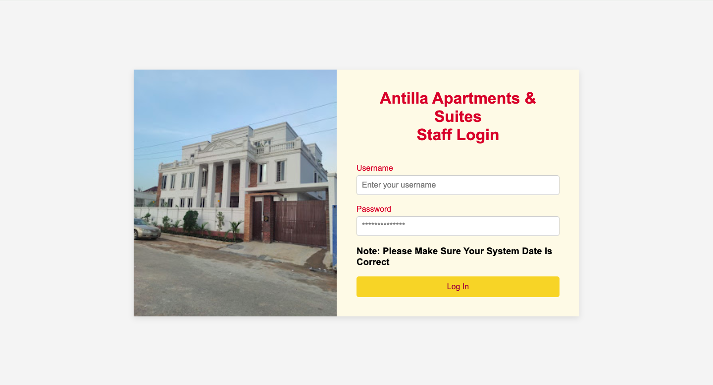
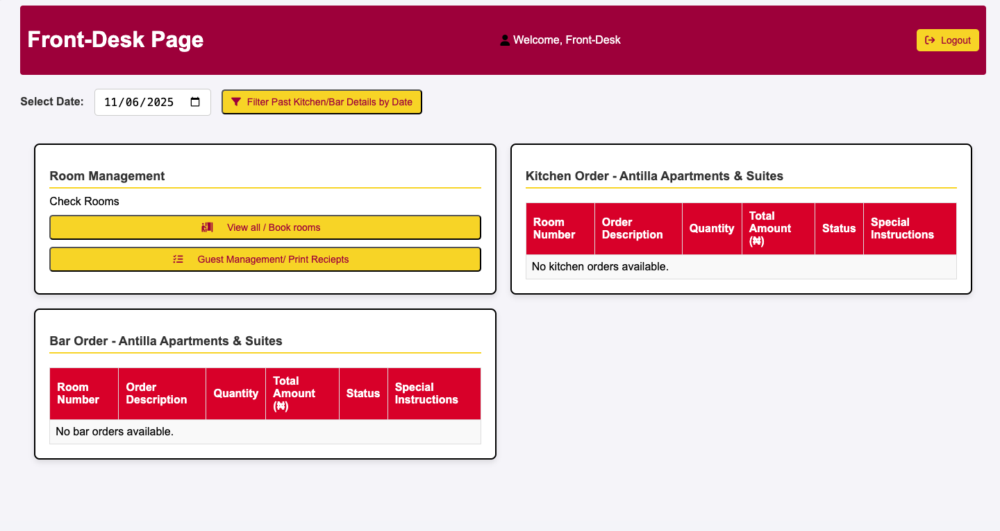
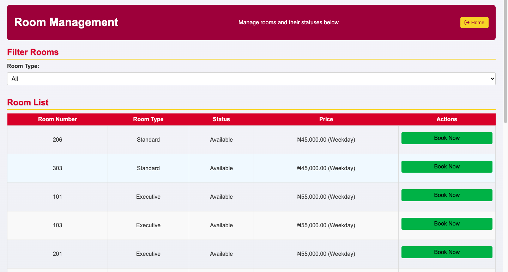
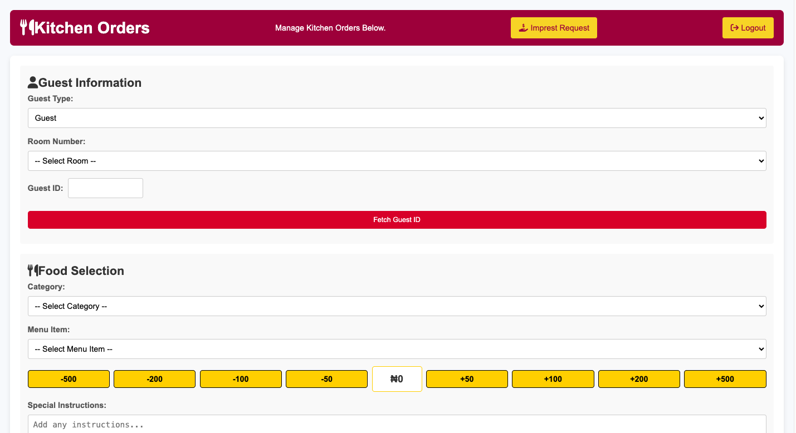
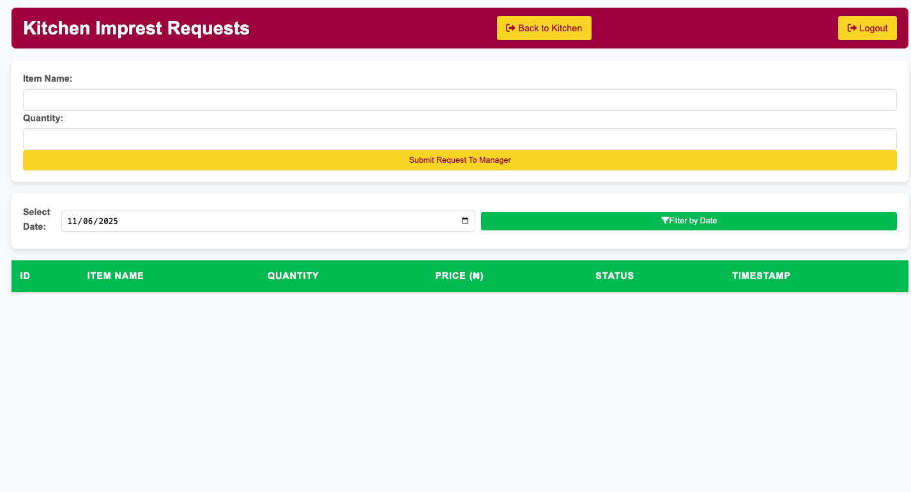
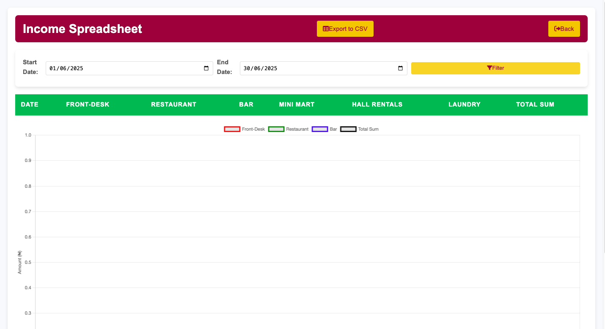

# 🏨 Antilla Hotel Management System

A web-based hotel management platform for handling bookings, kitchen/bar orders, imprest requests, guest management, and reporting. Built with PHP, MySQL, JavaScript, and modern CSS.

---

## 🚀 Features

- **Multi-role Login:** Staff can log in as Admin, Kitchen, Bar, Front Desk, or Manager, each with a custom dashboard.
- **Room Booking & Guest Management:** Check-in, check-out, and manage guest details and room status.
- **Kitchen & Bar Order Management:** Place, track, and complete orders with real-time updates and special instructions.
- **Imprest Requests:** Kitchen and Bar can submit imprest (supply) requests to the Manager for approval and completion.
- **Income & Expense Tracking:** View, filter, and export income and expense reports.
- **Order Status Tracking:** Mark orders as completed and view order history.
- **Responsive UI:** Clean, modern interface with Font Awesome icons and custom CSS.

---

## 🗂️ Project Structure

```
hotel2/
  add_order.php, add_order_bar.php
  bar.php, bar.js
  kitchen.php, kitchen.js
  imprest_request.php, imprest_request.js
  manager.php, manager_imprest.php
  home.php, home.js
  checkin_form.php, checkin.php, checkout.php
  guest_management.php
  income.php, expense.php
  mark_order.php
  ... (other modules and assets)
dashboard/
  ... (static help and info pages)
img/
  ... (images)
```

---

## ⚙️ Tech Stack

- **Backend:** PHP 7+, MySQL
- **Frontend:** HTML5, CSS3, JavaScript (vanilla + jQuery)
- **Icons:** Font Awesome
- **Deployment:** XAMPP/Apache (local), compatible with shared hosting

---

## 📝 Setup Instructions

1. **Clone the repository:**
   ```sh
   git clone https://github.com/yourusername/your-repo.git
   ```
2. **Import the database:**
   - Use phpMyAdmin or MySQL CLI to import the provided SQL file (if available).
3. **Configure database connection:**
   - Edit `hotel2/db_connect.php` with your MySQL credentials.
4. **Run locally:**
   - Place the project in your XAMPP `htdocs` directory.
   - Start Apache and MySQL via XAMPP.
   - Visit `http://localhost/hotel2/` in your browser.

---

## 📸 Screenshots








---

## 🙌 Contributions

Built with love by [Success Chukwuemeka](https://www.linkedin.com/in/success-chu) 💡  

---

For questions or contributions, please open an issue or pull request!
